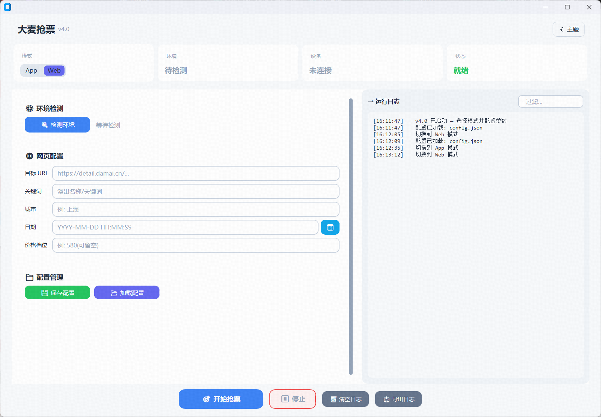

## ⚠️ 免责声明

**本项目仅供学习和技术交流使用，请务必遵守以下条款：**

1. **合法合规使用**：本工具仅用于学习 Selenium 和 Appium 自动化技术，请勿用于任何商业用途或违反服务条款的行为
2. **风险自负**：使用本工具可能存在账号被封禁、订单异常等风险，使用者需自行承担所有后果
3. **尊重平台规则**：请严格遵守大麦网的用户协议和服务条款，不得进行恶意刷票或影响平台正常运营的行为
4. **技术研究目的**：本项目主要用于研究移动端和网页自动化技术，不鼓励大规模或商业化使用
5. **免责条款**：开发者不对使用本工具造成的任何损失承担责任，包括但不限于账号封禁、财产损失等

**使用本工具即表示您已阅读并同意上述免责声明。如不同意，请立即停止使用。**

---

# 大麦抢票工具 🎫

一个功能完善的大麦网自动抢票工具，提供 **App 模式（手机端极速冲刺）** 和 **Web 模式（PC 浏览器）** 两种方案。

## 📸 界面预览

| App 模式                     | Web 模式                     |
| ---------------------------- | ---------------------------- |
|  |  |

---

## ✨ 核心功能

### 📱 App 模式（移动端极速抢票，推荐）

采用 **双阶段架构**：预热进入选票页 → 极速坐标盲点冲刺。

| 阶段                     | 说明                                                                        | 耗时       |
| ------------------------ | --------------------------------------------------------------------------- | ---------- |
| **预热 preheat()** | 连接 Appium → 搜索演出 → 进入选票页 → 预选场次/票价/数量 → 记录按钮坐标 | 开售前完成 |
| **冲刺 sprint()**  | CPU 自旋等到开售瞬间 → 坐标盲点确认 → 坐标盲点提交 → 进入付款页          | 每轮 ~30ms |

- **坐标盲点**：纯粹 `mobile: clickGesture` 注入触摸事件，零 `find_element`、零 `WebDriverWait`、零 `time.sleep`
- **Activity 检测**：`driver.current_activity` 判断页面跳转，每次仅 5-15ms
- **同一坐标打穿两页**：确认和提交按钮都在底部同区域，一套坐标点到底
- **自动降级**：坐标盲点 30s 无响应 → 自动回退 `find_element` 元素查找兜底
- **预热失败不影响流程**：自动回退到传统元素查找模式

### 🖥️ Web 模式（Selenium PC 浏览器）

- **一键式操作** - 简单易用的图形界面
- **智能登录管理** - Cookie 自动保存，免重复登录
- **参数化配置** - 可视化填写目标 URL、城市、日期、价格
- **实时日志显示** - 清晰显示抢票进度和状态
- **统一配置管理** - App/Web 共用同一配置文件 `config.json`

### 🔐 登录状态管理

- **Cookie 持久化** - 登录状态自动保存到 `damai_cookies.pkl`
- **免重复登录** - 启动时自动加载 Cookie
- **手动管理选项** - 可手动清除登录状态
- ⚠️ `damai_cookies.pkl` **不会自动随网页退出登录而更新**，需手动清除后重新登录

## 📋 使用流程

### App 模式（推荐）

1. 启动 v2 GUI：`python start_gui_v2.pyw`
2. 确认模式为 **App**，点击 **检测环境**
3. 填写 **Appium 服务地址**、点击 **刷新设备**
4. 填写 **抢票参数**（关键词、城市、场次/票价索引、数量）
5. 在 **定时抢票** 中设置 **开抢时间**，点击 **预约开抢**
6. 等待倒计时 → 自动预热 → 到点冲刺

> CLI 方式：`cd damai_appium && python damai_app_v2.py --start-at "2025-10-01 20:00:00" --warmup-sec 120`

### Web 模式

1. 启动 v2 GUI：`python start_gui_v2.pyw`
2. 切换为 **Web** 模式
3. 输入 **目标 URL**（大麦网演出详情页）
4. 填写关键词、城市、选择日期
5. 点击 **开始抢票** → 首次使用需扫码登录
6. Cookie 自动保存，后续免登录

## 🧩 环境要求

- **Python 3.7+**
- **Node.js + Appium**（App 模式需要）
- **Android 设备**（App 模式需要，支持真机或模拟器）
- **Chrome 浏览器 + ChromeDriver**（Web 模式需要）
- 依赖安装：`pip install -r requirements.txt`

## 💿 安装步骤

### 1. 准备 Python 环境

```powershell
# 创建虚拟环境（推荐）
python -m venv venv
.\venv\Scripts\Activate.ps1

# 安装项目依赖
python -m pip install -U pip
pip install -r requirements.txt
```

### 2. 安装 App 模式前置

```powershell
npm install -g appium
npm install -g appium-doctor
appium-doctor --android
```

- 下载 Android Platform Tools，将 `platform-tools` 目录加入系统 PATH
- 参考：[https://developer.android.com/tools/releases/platform-tools](https://developer.android.com/tools/releases/platform-tools)

### 3. 验证环境

```powershell
where adb
adb version
appium -v
```

### 4. 启动 Appium 服务

```powershell
appium --address 0.0.0.0 --port 4723 --relaxed-security
```

### 5. 连接设备

```powershell
adb devices -l
# 若显示 unauthorized，请在手机上确认 USB 调试授权
```

### 6. 启动 v2 GUI

```powershell
.\venv\Scripts\python.exe start_gui_v2.pyw
```

## 📁 项目结构

```text
damai-ticket-assistant/
├── start_gui.pyw               # v1 GUI 启动入口（旧版，保留）
├── start_gui_v2.pyw            # v2 GUI 启动入口（新版，推荐）
├── damai_gui.py                # v1 GUI 主窗口（旧版）
├── damai_gui_v2.py             # v2 GUI 主窗口（新版，CustomTkinter）
├── config.json                 # App/Web 共用配置文件
├── requirements.txt            # Python 依赖
│
├── damai_web/                  # Web 模式（Selenium）
│   └── concert.py              # WebConcert 后端
│
├── damai_appium/               # App 模式（Appium）
│   ├── runner.py               # 核心：preheat() + sprint()
│   ├── damai_app_v2.py         # CLI 入口
│   ├── config.py               # AppTicketConfig 配置模型
│   └── config.json             # 旧版配置文件（向后兼容）
│
├── comment/                    # GUI 自定义组件
│   ├── countdown_timer.py
│   ├── datetime_picker.py
│   ├── ant_button.py
│   └── date_picker_ctk.py      # CustomTkinter 日期选择器
│
├── assets/themes/
│   └── damai.json              # CustomTkinter 主题文件
│
├── docs/guides/
│   ├── APP_MODE_README.md      # App 模式详细文档
│   ├── WEB_MODE_README.md      # Web 模式详细文档
│   ├── app_image.png
│   └── web_image.png
│
└── venv/                       # Python 虚拟环境
```

## 🔧 高级功能

### 运行统计与日志导出

- App 模式流程结束后自动汇总尝试次数、重试次数、总耗时与最终阶段
- GUI 日志面板支持过滤和导出 JSON 报告
- CLI `--export-report` 参数可生成 JSON 报告

### 智能元素识别

- 多种购买按钮识别策略
- 观演人选择区域智能定位
- 提交按钮文本智能匹配

### 增强的错误处理

- 坐标盲点 → 元素查找，两层兜底
- JavaScript 辅助执行
- 详细的日志信息

## 🔮 项目优化

### App 模式极速冲刺

- 双阶段架构：预热（preheat）提前完成所有元素查找和坐标采集，冲刺（sprint）零查找纯坐标盲点
- `_spin_wait()` CPU 自旋等待开售时刻，大段时间 sleep 省 CPU，最后 1 秒纯自旋无等待
- `_fire_tap()` 直接注入 `mobile: clickGesture` 触摸事件，单次点击 5ms duration
- `_sprint_phase_confirm()` / `_sprint_phase_submit()` 每轮 20-65ms，activity 即时检测跳转
- 每 200 次坐标校准：`find_element` 获取按钮最新位置
- 30s 超时自动降级到 `_confirm_purchase()` / `_submit_order()` 元素查找模式

### UI 更新（v2）

- 基于 CustomTkinter 的现代化界面
- 暗/亮主题切换
- 卡片式布局，支持区域折叠
- Ant Design 风格日期选择器
- 日志批量刷新（200ms 间隔），500 条上限

## ⚠️ 使用注意

1. **合规使用** - 请严格遵守大麦网服务条款
2. **网络稳定** - 确保网络连接稳定可靠
3. **信息准确** - 抢票前确认个人信息完整
4. **理性使用** - 建议关闭自动提交，手动确认订单
5. **风险意识** - 了解使用自动化工具的潜在风险
6. **需手动支付** - 脚本到付款页即结束，不处理支付流程

## 🙏 致谢

本项目基于 [redhat1977/damai-ticket-assistant-app](https://github.com/redhat1977/damai-ticket-assistant-app) 进行开发和优化。

**特别感谢：**

- 原作者 **redhat1977** 提供的优秀基础框架
- 所有为开源项目做出贡献的开发者们
- 提供建议和反馈的用户社区

## 🤝 贡献指南

欢迎提交 Issue 和 Pull Request 来改进项目：

1. Fork 本仓库
2. 创建您的特性分支 (`git checkout -b feature/AmazingFeature`)
3. 提交您的更改 (`git commit -m 'Add some AmazingFeature'`)
4. 推送到分支 (`git push origin feature/AmazingFeature`)
5. 开启一个 Pull Request

## 📄 开源协议

本项目采用 MIT 协议开源，详情请参考 LICENSE 文件。

**重要提醒：** 本项目仅供学习和技术研究使用，请勿用于任何违反平台服务条款的行为。

## 📞 技术支持

如果遇到技术问题，可以：

- 📋 查看项目 [Issues](https://github.com/10000ge10000/damai-ticket-assistant/issues)
- 📖 阅读详细文档和说明
- 💬 在仓库中提交新的 Issue

**相关文档：**

- [App 模式技术文档](docs/guides/APP_MODE_README.md)
- [Web 模式使用说明](docs/guides/WEB_MODE_README.md)

---

## ⭐ 支持项目

如果这个项目对您有帮助，请考虑：

- 🌟 给本项目一个 Star
- 🔄 Fork 并贡献代码
- 📢 分享给其他开发者

**感谢您的支持！** 🎉
