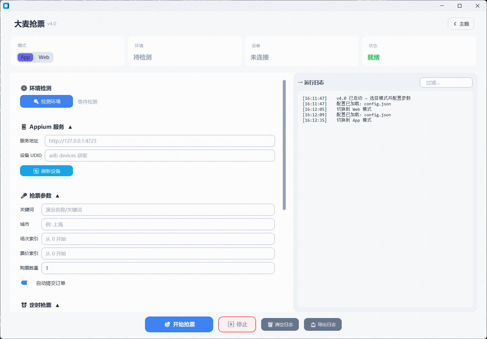

# 安卓端抢票方案 (App 模式)



## 架构

```
preheat()                    sprint(epoch)
┌────────────────────┐      ┌──────────────────────┐
│ 连接Appium          │      │ _spin_wait()         │
│ 选择城市            │      │ CPU 自旋等到开抢时间  │
│ 搜索演出            │      │                      │
│ 进入详情页          │      │ _sprint_phase_confirm│
│ 处理观演人弹窗      │      │ 盲点确认按钮(30ms/轮) │
│ 点击购买栏          │  ──► │ activity 检测跳转     │
│ 进入选票页          │      │                      │
│ 预选日期/场次/票价  │      │ _sprint_phase_submit │
│ 记录按钮坐标        │      │ 盲点提交按钮(30ms/轮) │
│ -> 停在选票页等待   │      │ activity 检测跳转     │
└────────────────────┘      │ -> 到付款页 ✅        │
                            └──────────────────────┘
```

## 执行命令

### 开启 appium 服务端

```bash
appium --address 0.0.0.0 --port 4723 --relaxed-security
```

### 定时抢票（推荐）

```bash
cd damai_appium
python damai_app_v2.py ^
  --start-at "2025-10-01 20:00:00" ^
  --warmup-sec 120 ^
  --retries 3
```

- `--start-at` 开抢时间，支持 `"2025-10-01T20:00:00+08:00"` 或 `"2025-10-01 20:00:00"`（本地时区）
- `--warmup-sec` 提前多少秒开始预热（进入选票页、预选、记录坐标），推荐 60-120s
- `--retries` 元素回退模式的重试次数（sprint 失败后的兜底）

### 立即执行（无定时）

```bash
python damai_app_v2.py --retries 3
```

可选参数：

- `--config` 指定自定义 JSON/JSONC 配置路径（默认 `config.jsonc`）
- `--export-report` 导出运行日志 JSON

## 配置文件要点

- 配置文件自动剥离注释（支持 JSONC）
- `price_index` / `session_index` 从 0 开始
- `users` 自动清理空白条目
- 如需自定义 Appium capabilities，在 `device_caps` 字段中覆写
- 配置文件位于项目根目录 `config.json`（App/Web 共用），或 `damai_appium/config.json`（向后兼容）

## 极速冲刺原理

### 主循环：坐标盲点 + Activity 检测

```
mobile: clickGesture(x, y, duration=5)    15-50ms
driver.current_activity                     5-15ms
────────────────────────────────────
每轮合计: 20-65ms，每秒 15-50 次
```

- **无 `find_element`**：通过预热阶段提前采集按钮坐标，冲刺阶段直接用坐标注入触摸事件
- **无 `WebDriverWait`**：通过 `current_activity` 检测页面跳转，失败立即重试，不浪费毫秒
- **无 `time.sleep`**：让 Appium HTTP 通信开销自然节流

### 同一坐标打穿两页

选票页的"确定"按钮和订单页的"立即提交"按钮都在屏幕底部固定区域，坐标相同且订单页按钮更大。冲刺阶段用一套坐标一路打穿：

```
选票页: 盲点坐标(x,y) → activity 变 → 进入订单页
订单页: 继续盲点同一坐标(x,y) → activity 变 → 进入付款页 ✅
```

### 坐标校准

主循环每 200 次点击（约 4-10 秒）做一次坐标校准：`find_element` 获取按钮最新位置并更新坐标。按钮消失则判定为跳转成功。

### 降级兜底链

```
sprint()
├─ _sprint_phase_confirm(timeout=30s)
│   坐标盲点 → 30s 没反应 → 回退 _confirm_purchase()
│   └─ WebDriverWait + find_element 无限循环直到成功
│
├─ _sprint_phase_submit(timeout=30s)
│   坐标盲点 → 30s 没反应 → 回退 _submit_order()
│   └─ 4 个选择器依次尝试 _smart_wait_and_click
│
└─ 到付款页
```

## 模块化 API

```python
from damai_appium import AppTicketConfig, DamaiAppTicketRunner

config = AppTicketConfig.load()
runner = DamaiAppTicketRunner(config=config)

# 方式 1：预热 + 冲刺（推荐）
runner.preheat()                      # 进选票页、预选、记录坐标
runner.sprint(target_epoch)           # 自旋等 → 盲点确认 → 盲点提交

# 方式 2：传统元素查找（兜底）
runner.run(max_retries=3)
```

`DamaiAppTicketRunner` 支持自定义日志回调、停止信号和驱动工厂：

```python
def logger(level, message, context):
    print(f"[{level}] {message}")

def stop_signal():
    return should_stop

runner = DamaiAppTicketRunner(
    config=config,
    logger=logger,
    stop_signal=stop_signal,
)
```

## GUI 使用

1. 打开 v2 GUI：双击 `start_gui_v2.pyw` 或运行 `python start_gui_v2.pyw`
2. 确认模式为 **App**
3. 点击 **检测环境** 验证 Appium 连接
4. 填写 **Appium 服务地址**（默认 `http://127.0.0.1:4723`）
5. 点击 **刷新设备** 自动填入设备 UDID
6. 填写 **抢票参数**（关键词、城市、场次/票价索引、数量）
7. 设置 **开抢时间** 和 **预热秒数**，点击 **预约开抢**
8. 等待倒计时 → 自动预热 → 到点冲刺

## 注意事项

1. **坐标稳定性**：同一设备 + 同版本 App 的按钮坐标固定。App 更新后坐标可能偏移，需要重新预热
2. **预热失败**不影响主流程——会自动回退到传统元素查找模式
3. **大段时间用 `time.sleep`**（省 CPU），**最后 1 秒转为 CPU 自旋**（微秒级精度）
4. **脚本到付款页即结束**，不处理支付流程，需手动完成
5. **预约场景**：预热阶段的 `_wait_and_tap_purchase_button` 以 10ms 间隔轮询购买栏，可进入选票页即进，不依赖开售状态
